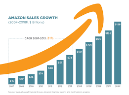

<!-- Custom Banner -->
<!-- 

  

 -->

<h2 align="center">👋🎉 Welcome to my page, I'm Harold Chanwin</h2>

  <b>Data & AI Student | Web Developer</b> 
  Curious and creative, I turn data into decisions and designs into immersive experiences.

---

### 🛠️ Key Skills

 <!-- 🔢 Data Science & Python Stack -->           <!-- 🌐 Front-End Development -->       <!-- 🧱 Back-End Development -->   <!-- 🗄️ Databases -->      <!-- 🔧 Tools -->  

---

### 📊 GitHub Stats

  
  

  

---

### 🚀 Featured Projects

<table>
  <tr>
    <td align="center">
      <a href="https://github.com/chanwinharold/Amazon_Sales" target="_blank">
        
         <b>📈 Amazon Sales</b>
      </a>
       Interactive data analysis and visualization of sales data
    </td>
    <td align="center">
      <a href="https://github.com/chanwinharold/Prevision_du_prix_des_vols" target="_blank">
        
         <b>📊 Exploratory analysis of air flight data</b>
      </a>
       Exploratory Data Analysis (EDA) project for flight price prediction.
    </td>
    <td align="center">
      <a href="https://github.com/chanwinharold/Netflix_Data_Project" target="_blank">
        
         <b>📊 Netflix Data Analysis</b>
      </a>
       Data analysis and visualization of movies and TV Shows
    </td>
	<td align="center">
      <a href="https://github.com/chanwinharold/Youtube_Data_Project" target="_blank">
        
         <b>📊​ Youtube Streaming Videos</b>
      </a>
       Data analysis and visualization of the most popular YouTube videos
    </td>
  </tr>

  <tr>
    <td align="center">
      <a href="https://ecommerce-product-page-main-orpin-eight.vercel.app/" target="_blank">
        
         <b>👟 E-commerce Site: Sneakers</b>
      </a>
       Responsive front-end e-commerce website using HTML, Tailwind CSS, and JavaScript
    </td>
	<td align="center">
      <a href="https://loopstudios-landing-page-main-drab-three.vercel.app/" target="_blank">
        
         <b>Loopstudios landing page challenge</b>
      </a>
       Responsive landing page using HTML, pure CSS, and JavaScript
    </td>
	<td align="center">
      <a href="https://conference-ticket-generator-main-two.vercel.app/" target="_blank">
        
         <b>🎟️​ Ticket Generator</b>
      </a>
       Responsive form and ticket generator using HTML, Tailwind CSS, and JavaScript
    </td>
    <td align="center">
      <a href="https://sunnyside-agency-landing-page-main-smoky-five.vercel.app/" target="_blank">
        
         <b>Sunnyside agency landing page challenge</b>
      </a>
       Responsive landing page using HTML, Sass/Scss, and JavaScript
    </td>
  </tr>
</table>

### 🧩 Interactions & Widgets

  
  

---

### 🔗 Find me on the web

  
  
  

---

### ✨ About Me

- 🎓 Student in applied mathematics & data science
- 💡 Currently learning React JS, back-end technologies and machine learning
- 💻 Leader of Front-end department at [USD's Community](https://www.linkedin.com/company/united-student-developers)
- 🌱 I believe in community-driven learning and open source
- 🎯 2025 Goal: Build an impactful project combining web and data

---

> _"Data is a story waiting to be told. I'm here to give it a voice."_ – Harold Chanwin

  

