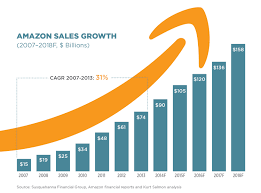

<!-- Bannière personnalisée -->

  

<h2 align="center">👋🎉 Bienvenue sur ma page, je suis Harold Chanwin</h2>

  <b>Étudiant en Data & IA | Développeur Front-End</b> 
  Curieux et créatif, je transforme les données en décisions et les designs en expériences immersives.

---

### 🛠️ Compétences Clés

  
  
  
  
  
  
  
  
  
  
  
  
  
  
  

---

### 📊 Statistiques GitHub

  
  

  

---

### 🚀 Projets en Vedette

<table>
  <tr>
    <td align="center">
      <a href="https://github.com/chanwinharold/Amazon_Sales">
        
         <b>📈 Amazon Sales</b>
      </a>
       Analyse et visualisation interactive des données de ventes
    </td>
    <td align="center">
      <a href="https://youtube-data-project.vercel.app/">
        
         <b>📊​ Youtube Streaming Videos</b>
      </a>
       Analyse et Visualisation des données sur les vidéos YouTube les plus populaires
    </td>
    <td align="center">
      <a href="https://conference-ticket-generator-main-two.vercel.app/">
        
         <b>🎟️​ Générateur de ticket</b>
      </a>
       Front-end responsive avec HTML, Tailwind CSS et JavaScript
    </td>
  </tr>
</table>

### 🧩 Interactions & Widgets

  
  

---

### 🔗 Retrouve-moi sur le web

  
  
  

---

### ✨ À propos de moi

- 🎓 Étudiant en mathématiques appliquées & data science
- 💡 Actuellement en train d'apprendre des frameworks front-end et l'analyse multivariée.
- 🌱 Je crois en l’apprentissage communautaire et en l’open source
- 🎯 Objectif 2025 : Construire un projet impactant combinant le web et la data

---

> *“La donnée est une histoire qui attend d’être racontée. Je suis ici pour lui donner une voix.”* – Harold Chanwin

  

